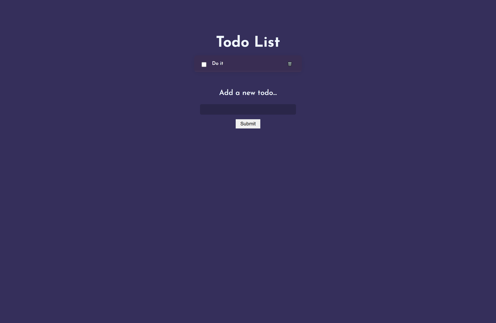

# ✅ To-Do Web App

A simple and responsive To-Do List application built using **React**. Manage your daily tasks with a clean and intuitive interface.

---

## 🔗 Live Demo

👉 _(Demo link not provided — feel free to add a GitHub Pages or Netlify link here)_

---

## 🧠 Features

- ➕ Add new tasks
- ✅ Mark tasks as complete
- ❌ Delete tasks
- 📱 Responsive layout for all screen sizes

---

## 🖼️ Screenshots

> Add your screenshots in a `screenshots/` folder and update the paths below



---

## 🛠️ Tech Stack

- React.js
- HTML/CSS
- JavaScript (useState, props)

---

## 📦 Installation

```bash
git clone https://github.com/kichu3000/ToDoWeb-React.git
cd ToDoWeb-React
npm install
npm run dev
```

## 📁 Folder Structure

```
ToDoWeb-React/
├── src/
│ ├── App.jsx
│ ├── index.css
│ └── main.jsx
├── public/
│ └── index.html
├── screenshots/
│ ├── todo-home.png
│ └── todo-tasks.png
├── vite.config.js
├── package.json
└── README.md
```

### 👨‍💻 Author

Made with ❤️ by Kichu
